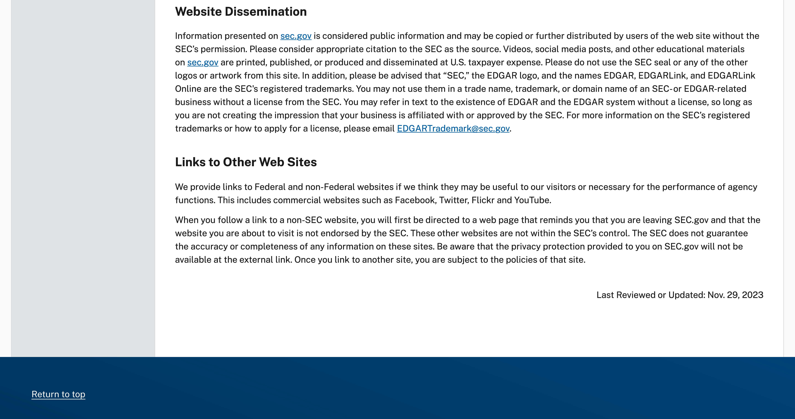
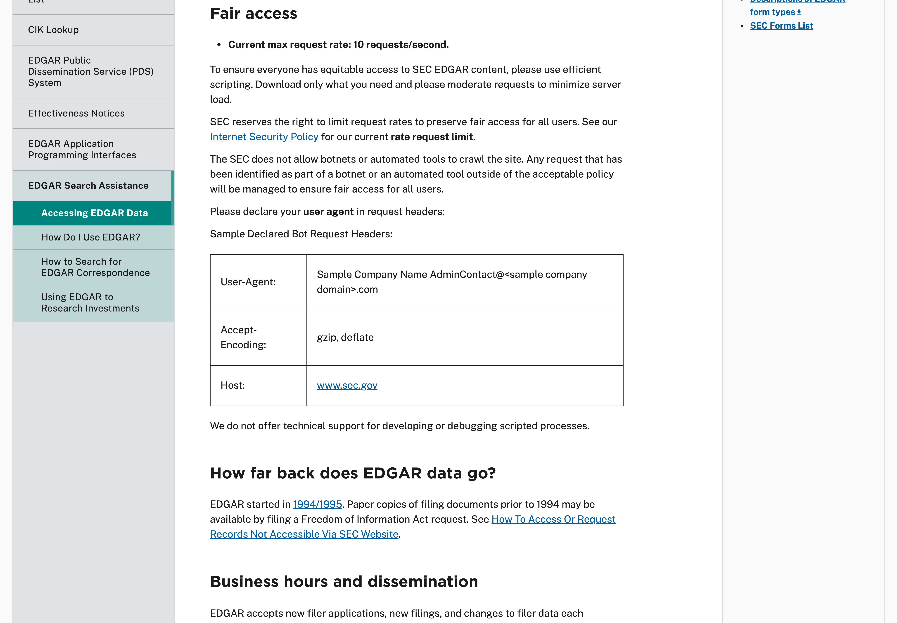
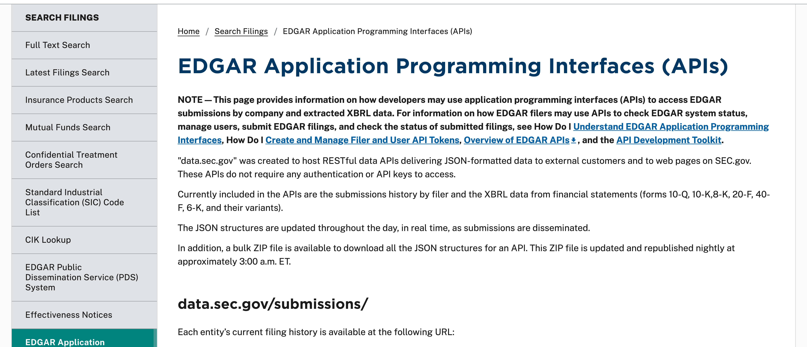

# SEC Data and Public Filings

*Last updated: 10 August 2026*

Everything on the Smart Investor Tracker, the Portfolios page, and the Promoter Buying
page is read from data published by the **United States Securities and Exchange
Commission**. This page records what the SEC itself says about reusing that data, quotes
its own words, links to where they appear, and sets out what we do to stay inside those
rules. The screenshots below were captured from the SEC's website on 10 August 2026 and
are kept so that our reading of its policy can be checked against the originals.

## The SEC's permission, in its own words

The SEC's website privacy and security policy contains a section titled *Website
Dissemination*, which reads:

> Information presented on sec.gov is considered public information and may be copied or
> further distributed by users of the web site without the SEC's permission. Please
> consider appropriate citation to the SEC as the source.

That is the whole of the permission, and it covers what we do: the filings we read are
information presented on sec.gov, and copying and further distributing them is what a
tracker is. Nothing in the policy restricts this to non-commercial use.

Source: [SEC Web Site Privacy and Security Policy](https://www.sec.gov/privacy)
(section: *Website Dissemination*; the page notes it was last reviewed or updated on
November 29, 2023).

## The conditions the SEC attaches, and what we do about each

The same policy section attaches conditions. There are three that apply to us.

**Citation.** The SEC asks for appropriate citation to itself as the source. Every entry
on our pages names the filing it came from and links to the original document on
sec.gov, and the pages carry a source line naming the SEC. Anyone can follow those links
and check our reading against the originals rather than take our word for it.

**No seal or artwork.** The SEC asks that its seal, logos, and other artwork not be used.
We use none. The pages carry our own branding only.

**Trademarks and affiliation.** In the SEC's words, *"SEC," the EDGAR logo, and the names
EDGAR, EDGARLink, and EDGARLink Online are the SEC's registered trademarks*, and they may
not be used *in a trade name, trademark, or domain name of an SEC- or EDGAR-related
business* without a license. Our names and domains contain none of them. The policy goes
on to say that anyone *may refer in text to the existence of EDGAR and the EDGAR system
without a license, so long as you are not creating the impression that your business is
affiliated with or approved by the SEC*. We refer to EDGAR only in text, as the system
the filings come from, and the pages state plainly that the SEC does not endorse, sponsor,
or verify them and is not affiliated with us in any way.

## How we collect the data: the SEC's access rules

The SEC publishes separate rules for automated access to its data. Its
[Accessing EDGAR Data](https://www.sec.gov/search-filings/edgar-search-assistance/accessing-edgar-data)
page states, under *Fair access*:

> Current max request rate: 10 requests/second.

> Please declare your user agent in request headers.

Our collection follows both. Every request our system makes carries a declared identity
naming this publication and a contact address, exactly as the SEC's sample headers
prescribe. The system runs once each morning and makes a few dozen requests in total —
a small fraction of the permitted rate, and nothing like the botnets the rule is aimed at.

Nor is the data something we are merely tolerated in taking. The SEC maintains a
[dedicated programming interface](https://www.sec.gov/search-filings/edgar-application-programming-interfaces)
for exactly this purpose, in its own words:

> "data.sec.gov" was created to host RESTful data APIs delivering JSON-formatted data to
> external customers and to web pages on SEC.gov. These APIs do not require any
> authentication or API keys to access.

That interface is what we read: each tracked filer's public filing history, straight from
the SEC's own servers.

## What can still go wrong

Two cautions follow from the SEC's own descriptions, and both are why our pages carry an
errors-and-omissions line.

**Filings can change after we read them.** The SEC notes that filings are sometimes
corrected or removed at the filer's request after acceptance, and that such changes are
folded into its indexes only on a schedule. A snapshot like ours can therefore drift from
the live record until the next collection run. The original on sec.gov is always the
authoritative version, which is why every entry links to it.

**The SEC does not vouch for what filers write.** The filings are the filers' own
statements, published by the SEC, not verified by it. A holding or a trade can be
misreported by the filer and later amended. We read what is filed; we cannot read what
was meant.

## And the usual, because it applies here too

This publication is impersonal commentary of general and regular circulation. It is not
investment advice, it is not a recommendation to buy or sell any security, and it is not
tailored to any person or their circumstances. Please read the full
[Disclaimer](disclaimer.html) before relying on anything here.

Questions are welcome at
[hello@themicrocapminute.in](mailto:hello@themicrocapminute.in).
