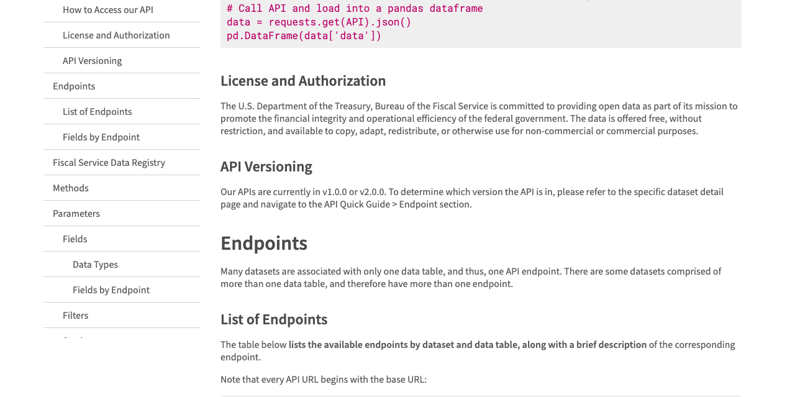
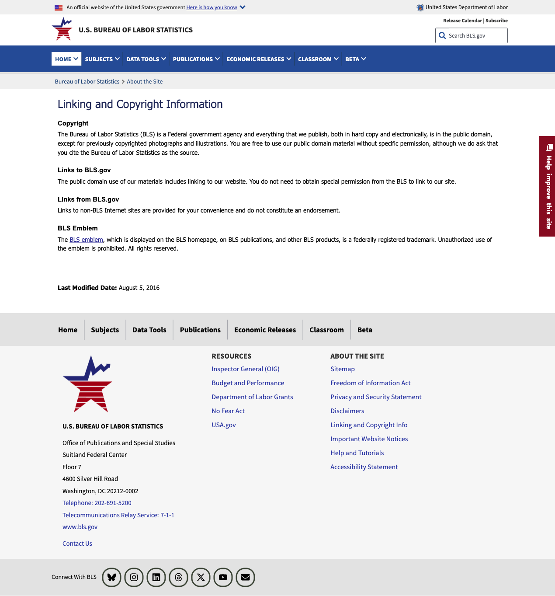
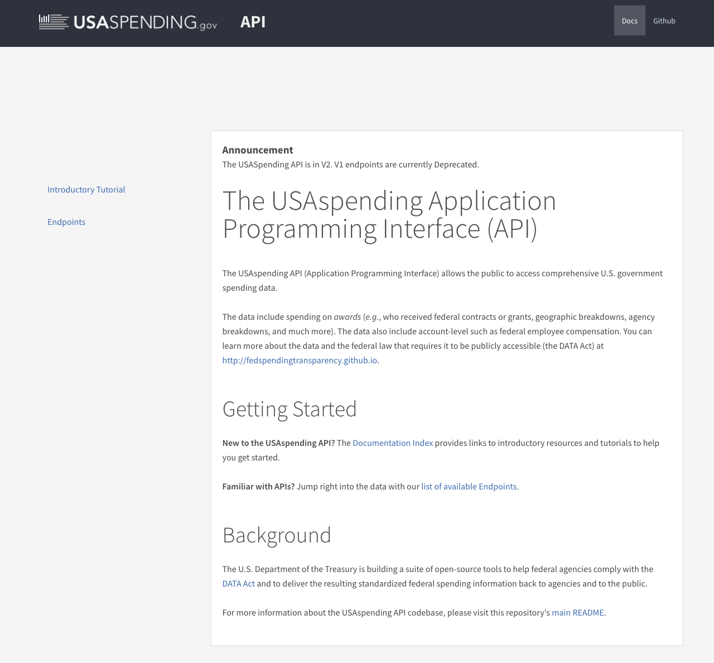
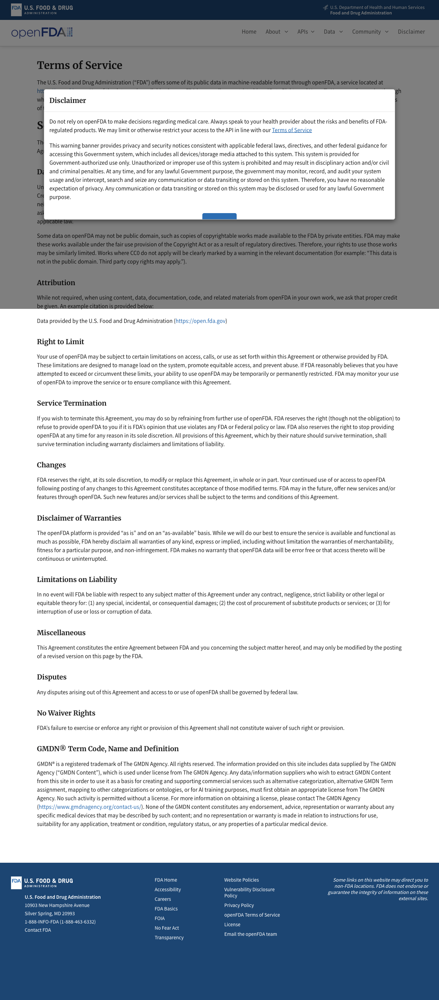
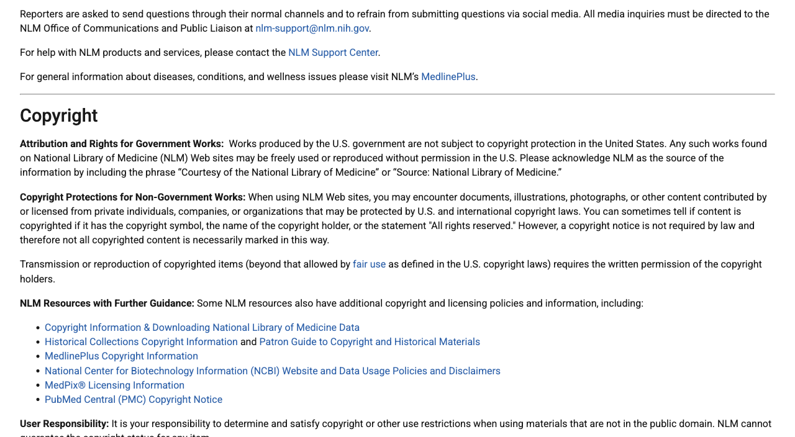
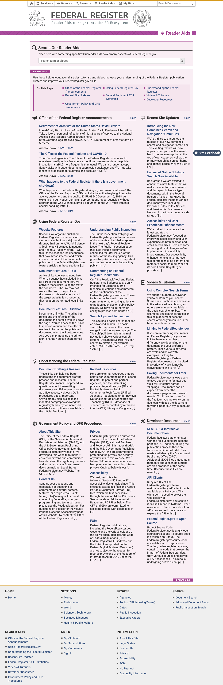
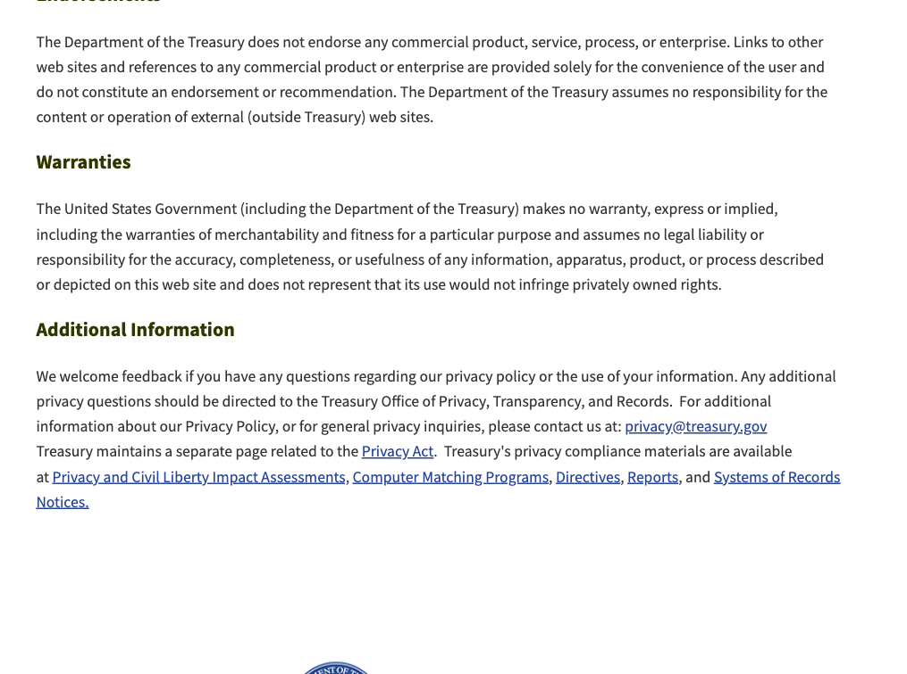

# US Government Data

*Last updated: 11 August 2026*

Some of our pages read numbers and records published by United States government
agencies other than the SEC: the Treasury's FiscalData service and daily interest rate
tables, the Bureau of Labor Statistics, the Federal Register, USAspending, the FDA's
openFDA service, and ClinicalTrials.gov. The macro dashboard reads the first four; the
tracker pages that report government contracts and drug and trial news read the rest.
This page records what each agency itself says about reusing its data, quotes its own
words, links to where they appear, and sets out what we do to stay inside those rules.
The rules below were read from the agencies' own websites on 11 August 2026, and the
screenshots below were captured from those websites the same day, so that our reading
can be checked against the originals. The
[SEC Data and Public Filings](sec-data.html) page covers the SEC separately.

## The permissions, in the agencies' own words

**Treasury FiscalData** (national debt, government cash, average interest rates) carries
the most permissive terms we have found anywhere:

> The data is offered free, without restriction, and available to copy, adapt,
> redistribute, or otherwise use for non-commercial or commercial purposes.

> Our API is open, meaning that it does not require a user account or registration for a
> token.

Source: [FiscalData API documentation](https://fiscaldata.treasury.gov/api-documentation/)
(section: *License and Authorization*).

**The Treasury's daily yield curve tables** are covered by the Treasury's site-wide
policies. As a work of the United States government the data is public by default; the
Treasury's conditions are about its seal and about warranties, and are quoted further
down this page.

**The Bureau of Labor Statistics** (inflation and jobs numbers) is explicit:

> The Bureau of Labor Statistics (BLS) is a Federal government agency and everything that
> we publish, both in hard copy and electronically, is in the public domain, except for
> previously copyrighted photographs and illustrations. You are free to use our public
> domain material without specific permission, although we do ask that you cite the
> Bureau of Labor Statistics as the source.

Source: [BLS, Linking and Copyright Information](https://www.bls.gov/bls/linksite.htm).

**The Federal Register** (new rules and notices) requires no key and no permission:

> FederalRegister.gov APIs do not require API keys; all you need is an HTTP client or
> browser.

Source: [FederalRegister.gov API documentation](https://www.federalregister.gov/developers/documentation/api/v1).
Its parent archive confirms the general rule:

> By virtue of the foregoing, public documents can generally be reprinted without legal
> restriction.

Source: [govinfo.gov, About and Policies](https://www.govinfo.gov/about/policies)
(Public Domain and Copyright Notice).

**USAspending** (federal contracts and grants) is published under the DATA Act precisely
so the public can read it:

> The USAspending Application Programming Interface (API) allows the public to access
> comprehensive U.S. government spending data.

Source: [api.usaspending.gov](https://api.usaspending.gov/). The government's open data
catalog lists the dataset's access level as public, published by the Treasury's Bureau of
the Fiscal Service
([catalog.data.gov](https://catalog.data.gov/dataset/usaspending-gov-federal-award-subaward-and-account-data)).

**openFDA** (drug approvals, device clearances) dedicates its material to the public
domain:

> Unless otherwise noted, the content, data, documentation, code, and related materials
> on openFDA is public domain and made available with a Creative Commons CC0 1.0
> Universal dedication. ... You can copy, modify, distribute, and perform the work, even
> for commercial purposes, all without asking permission.

Source: [openFDA Terms of Service](https://open.fda.gov/terms/).

**ClinicalTrials.gov** (trial registrations and status changes) makes its data available
to all requesters at no charge, and the National Library of Medicine states the general
rule for its sites:
> Works produced by the U.S. government are not subject to copyright protection in the
> United States. Any such works found on National Library of Medicine (NLM) Web sites may
> be freely used or reproduced without permission in the U.S.

Source: [NLM Web Policies](https://www.nlm.nih.gov/web_policies.html). One wrinkle is
worth stating plainly: ClinicalTrials.gov says its data carries copyright outside the
United States, and it licenses that data on conditions (credit, freshness, and notes on
any changes), which we follow and describe below.

**FRED** (the Federal Reserve Bank of St. Louis data service, used for the Fed's own
policy rate and weekly jobless claims on the macro dashboard) encourages reuse:

> In general, the Federal Reserve Bank of St. Louis encourages the use of FRED data, and
> associated materials, to support policymakers, researchers, journalists, teachers,
> students, businesses, and the general public.

Source: [FRED Legal Notices](https://fred.stlouisfed.org/legal/). FRED sorts its series
into three tiers. "Public Domain: Citation requested" and "Copyrighted: Citation
required" series may be republished, including commercially, with attribution; series
marked "Copyrighted: Pre-approval required" may not be republished at all without the
owner's permission. We use only series that carry no copyright notice (the Fed funds
rate, DFF, and initial jobless claims, ICSA), we show the suggested citation on the
tiles that use them, and we display the notice the API terms require: "This product uses
the FRED® API but is not endorsed or certified by the Federal Reserve Bank of St. Louis."
We fetch current values for display and do not maintain a permanent mirror archive of
FRED content.

**The Office of Government Ethics** (cabinet members' financial disclosures, used by the
tracker's Cabinet page) works differently from everything else on this page: the law
restricts how disclosure reports may be used, and carves out journalism by name:

> It shall be unlawful for any person to obtain or use a report- (A) for any unlawful
> purpose; (B) for any commercial purpose, other than by news and communications media
> for dissemination to the general public; (C) for determining or establishing the
> credit rating of any individual; or (D) for use, directly or indirectly, in the
> solicitation of money for any political, charitable, or other purpose.

Source: [5 U.S.C. § 13107(c)](https://www.govinfo.gov/link/uscode/5/13107?link-type=html),
the Ethics in Government Act's prohibited-uses clause. So the rule for us is exact: these
reports may be shown to you only as news for the general public, which is what this
publication is. We never use them for fundraising, credit, or any paid data product, and
the Cabinet page exists only as free public journalism. Access is through OGE's
attestation-gated request system (its Form 201 portal and the Officials' Individual
Disclosures Collection), and requests are made in the publisher's own name as a news
requester, as the statute's application procedure requires.

## The conditions they attach, and what we do about each

**Attribution.** BLS asks to be cited; NLM asks for "Source: National Library of
Medicine" and for ClinicalTrials.gov data to be attributed to ClinicalTrials.gov; openFDA
suggests "Data provided by the U.S. Food and Drug Administration (https://open.fda.gov)";
Treasury and the others require nothing but deserve the same. So every figure on our
pages carries a source line naming the agency and linking to the underlying record, and
every page states when its data was last collected. Anyone can follow those links and
check our numbers against the originals.

**No seals, emblems, or logos.** The Treasury controls its seal by statute (31 U.S.C.
333), the BLS emblem is a federally registered trademark whose unauthorized use is
prohibited, and NLM states that its logos "may not be used by the private sector". We use
no agency seal, emblem, or logo anywhere, and no agency's name appears in our names or
domains.

**No implied endorsement.** openFDA's license asks that users not imply endorsement by
the FDA, and the Treasury says it "does not endorse any commercial product, service,
process, or enterprise". Our pages state that they are independent, are not affiliated
with or endorsed by any government agency, and that the agencies do not verify what we
build on their data.

**The Federal Register is not the official legal edition.** Its own notice reads:

> This site displays a prototype of a "Web 2.0" version of the daily Federal Register. It
> is not an official legal edition of the Federal Register, and does not replace the
> official print version or the official electronic version on GPO's govinfo.gov.

Source: [FederalRegister.gov Reader Aids](https://www.federalregister.gov/reader-aids).
So where our pages surface a rule or notice, we link the document's official record on
govinfo.gov as well, and nothing on our pages should be treated as legal notice.

**ClinicalTrials.gov's freshness rule.** Its terms ask redistributors to attribute the
data, keep it current, display the date the data were processed, and describe any
modifications. Our trial entries show the as-of date of our source copy and link to the
live record, and our only modification is that we reformat the fields for display; we
claim no proprietary rights in the data, which remains a United States Government
database. (The current terms page is a scripted application that text tools cannot read;
these conditions are quoted from the archived copy of the same official terms page, and
the NLM policy quotes above are from the live NLM site.)

**openFDA's two specific cautions.** Some device data includes GMDN terms, which are a
third party's registered content and not part of openFDA's public domain grant; we do not
republish GMDN fields. And on adverse event reports, the FDA is blunt:

> Adverse event reports submitted to FDA do not undergo extensive validation or
> verification. Therefore, a causal relationship cannot be established between product
> and reactions listed in a report.

Source: [openFDA, drug adverse events](https://open.fda.gov/apis/drug/event/). Any page of
ours that ever shows such a report will repeat that caution on its face.

**The data is as-is.** Every agency disclaims accuracy warranties in roughly the same
words as the Treasury:

> The United States Government (including the Department of the Treasury) makes no
> warranty, express or implied, including the warranties of merchantability and fitness
> for a particular purpose and assumes no legal liability or responsibility for the
> accuracy, completeness, or usefulness of any information...

Source: [Treasury privacy policy, Legal Disclaimers](https://home.treasury.gov/subfooter/privacy-policy).
USAspending adds its own practical caution: its figures are reported by hundreds of
agencies and are known to contain gaps and errors, so we describe them as agency-reported
data and do not silently correct them. Our pages repeat an errors-and-omissions line, and
the linked official record is always the authoritative version.

## How we collect the data

The same discipline as with the SEC, described on the
[SEC data page](sec-data.html): a declared identity on every request, a fixed collection
window each morning (Indian time) after the US agencies publish, and never live updates.
Where an agency publishes numeric limits, we stay far inside them. The BLS allows 25
queries a day without registration and 500 with a free key, at most 50 requests per ten
seconds; a handful of series once a morning is a fraction of that, and the BLS blocks
bots that do not conform to its usage policy, which we intend never to test. openFDA
allows 240 requests a minute and 1,000 a day without a key; we use a few. The Treasury,
the Federal Register, and USAspending publish no numeric limits and ask only for
reasonable use, which a once-daily batch is.

## What can still go wrong

The agencies publish the data; they do not vouch for every value in it, and neither can
we. Figures are revised (inflation and jobs numbers especially), awards are amended, and
trial records change. A snapshot like ours can drift from the live record until the next
collection run. The source line under every figure exists so that you can check the
original rather than take our word for it.

## And the usual, because it applies here too

This publication is impersonal commentary of general and regular circulation. It is not
investment advice, it is not a recommendation to buy or sell any security, and it is not
tailored to any person or their circumstances. Please read the full
[Disclaimer](disclaimer.html) before relying on anything here.

Questions are welcome at
[hello@themicrocapminute.in](mailto:hello@themicrocapminute.in).
